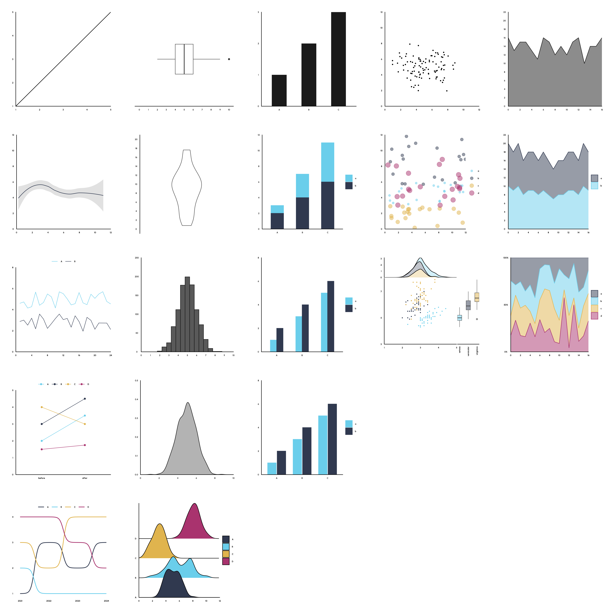

# Typology of data visualizations

In photography, a typology is a series of images that share a common subject or theme. Each photograph contributes to a larger narrative, and the series as a whole provides a more comprehensive understanding of the subject than any individual image. In college I took a photography class and was introduced to this concept which I found fascinating. For that class I created my own typology of water spigots around campus.

I wanted to apply this concept to data visualizations. So I used R and ggplot2 to create some common visualizations and grouped them by type. For each type, I wanted to show an evolution of complexity. I started with the most basic form for each visualization and then added more complexity to show how the visualization can be modified to show more information, or show information in a different manner.

To fully embrace the concept of a typology, I created a distinct visual theme to be shared by visualizations, carefully selecting colors, fonts, and other design elements. This approach ensures that comparing the visualizations is a breeze, allowing viewers to effortlessly identify the overarching narrative.

I wanted to add more visuals but as you add each plot, each plot becomes smaller and harder to see. I enjoyed creating this and I had fun diving into some new funtions and packages that extend ggplot2. Feel free to check out the code and let me know what you think!
